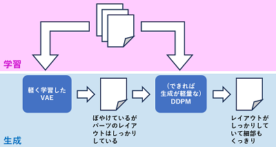

<html lang="ja">
    <head>
        <meta charset="utf-8" />
    </head>
    <body>
        <h1>
VAE
</h1>
        <h2>なにものか？</h2>
        

            VAEにより画像生成するプログラムです。  
            学習は GPU 無しだと遅すぎますが、画像生成は CPU のみでもサクサク実行できます。 
            ゼロから作るシリーズの MNIST 生成サンプルを 128 x 128 のカラー画像生成用に改造しました。  
            (学習例) <a href="https://images.cv/download/cat_face/5444">猫画像データセット</a>からの2,504枚画像で学習を実施 
            (画像生成例1) python src\animate.py 
             
            (画像生成例2) python src\generate.py 
             
            (画像生成例3) python src\animate.py data\vae_model_faces.pth 
             
        

        <h2>環境構築方法</h2>
        <h3>PyTorch</h3>
        

              <a href="https://pytorch.org/get-started/previous-versions/">PyTorchホームページ</a>のv1.13.1のインストール手順を参照ください 
              CPUのみの場合 
              pip install torch==1.13.1+cpu torchvision==0.14.1+cpu torchaudio==0.13.1 --extra-index-url https://download.pytorch.org/whl/cpu
        

        <h3>OpenCV</h3>
        

              pip install opencv-python 
        

        <h3>Numpy</h3>
        

              pip install numpy==1.26.1
        

        <h2>使い方</h2>
        
        <h3>準備</h3>
        

            学習データ用の画像群を 128x128 にリサイズし、.npy にまとめます。 
            python create_training_data.py (画像ファイルに対するワイルドカード) 
            (例) python create_training_data.py  *.jpg
        

        <h3>学習</h3>
        

            (新規学習) python train.py (学習データ(.npy)) 
            ※ lossが3,000未満になるまでパラメータが保存されません。変更したい場合は lossIdxMin に代入している値を変更してください。 
            (学習再開) python train.py (学習データ(.npy)) (modelデータ(.pth)) (optimizerデータ(.pth)) 
        

        <h3>生成</h3>
        

            (アニメーション) python animate.py (modelデータ(.pth)) 
             
            (画像一覧生成)   python generate.py (modelデータ(.pth)) 
            <table border="1">
                <tr><th>操作</th><th>機能</th></tr>
                <tr><td>ESCキー押下</td><td>プログラム終了</td></tr>
                <tr><td>矢印キー押下</td><td>画像選択カーソルの移動</td></tr>
                <tr><td>sキー押下</td><td>選択された画像の保存</td></tr>
                <tr><td>Sキー押下</td><td>スクリーン(画像群)の保存</td></tr>
                <tr><td>iキー押下</td><td>補間モードに移行</td></tr>
                <tr><td>rキー押下</td><td>ランダムモードに移行</td></tr>
                <tr><td>その他のキー押下</td><td>生成画像の更新</td></tr>
            </table>
        

        <h2>その他</h2>
        

            モデルパラメータが20MB未満になるように hidden_dim=50, latent_dim =10 に設定しています。 
            これらのパラメータを大きくすると生成品質が改善するかもしれません(未確認^^;) 
             
            同じデータセットでDVGAN、DDPMを試した結果 
            (DCGAN) 
            ・VAEより鮮明だが、アナログビデオのような画質... 
            ・モデル崩壊が起こり始めているのか、同じような画像が度々現れる 
            ・軽量(CPUでもサクサク生成できる) 
             
            (DDPM) 
            ・パーツは鮮明だが、パーツ間のレイアウトを正常に学習できていない 
            　データが少なすぎるのか、学習が不十分なのか 
            ・重い(CPUではいつまで経っても生成できない) 
             
            DDPMの入力を乱数から、VAE出力に変えてみたところ、パーツレイアウトが安定した。 
            (試行錯誤の結果、VAE出力の振幅を半分にして、デノイズ回数を1,000回から300回に減らした) 
             
            ・VAE出力(DDPM入力) 
             
            ・VAEを入力した場合のDDPM出力 
              python src\vae_ddpm_generate.py data\vae_model_faces.pth data\ddpm_model_faces.pth 4 4 
             
            ・乱数を入力としたDDPM出力 
              python src\ddpm_generate.py data\ddpm_model_faces.pth 4 4 
             
            ・VAE出力のかわりに画像を入力し、DDPMモデルで画像生成してみる 
            　python src\ddpm_derive.py (画像ファイル) 
        

        <h3>小手先の対応</h3>
        

            ・学習データにZCA whiteningを適用する 
            　⇒ 4096×4096の行列が重いのか処理が終わらず断念 
             
            ・学習データにフィルタを適用 (VAEでボケるなら学習データのエッジを強調してみては？という思い付き...) 
            　(エッジ強調) python src\filter2dTrainData.py (学習データ(.npy)) 
            　(結果)　　　 data\vae_filter2d_model.pth 
            　(コントラスト補正) python src\claheTrainData.py (学習データ(.npy))  
            　(結果)　　　 data\vae_clahed_model.pth 
            　(ぼかし)　python src\blurTrainData.py (学習データ(.npy)) 
            　(結果)　　なし 
            
            ・学習データのマージ 
            　python src\mergeTrainData.py (学習データ1(.npy) (学習データ2(.npy)) 
            
            ・学習データの表示 
            　python src\display_training_data.py (学習データ(.npy)) 
             
            ・モーフィングで画像枚数を増やす 
            　python src\FaceMorph3D_wildcard.py (画像群へのワイルドカード) 
             
            ・元の画像のアスペクト比を維持した学習データの作成 
            　python src\create_training_data_keep_aspect_ratio.py (画像群へのワイルドカード) 
             
            アスペクト比維持＋コントラスト補正 
             
        

        <h3>小手先の対応2</h3>
        

        　ぼかした学習データを渡して、デコード画像のボケを改善できないか試してみた。 
        　効果はよく判らず･･･ 
        　ワークフローと狙いは以下 
        　 
            ・学習データをぼかす：　python blurTrainData.py (学習データ(.npy)) [<ガウスフィルタサイズ(default:7)>]]  
            ・ぼかした学習データを使って学習：　python train_sharp_blurred.py (学習データ(.npy))　(ぼかした学習データ(.npy))
        

        <h3>小手先の対応3</h3>
        

        しつこく、小手先の対応を試してみた。(CPUでも生成が可能なVAEでぼやけるのを直したい･･･世の中, ナノバナナとか言っているのに･･･） 
         
        ぼやけた生成画像に後処理でHigh Pass Filterを掛けるより多少良い気がする(ひいき目) 
        ・ぼやけた生成画像          
        ・modelLPF+modelHPFでぼけを改善 
         
        ・ぼやけた生成画像に後処理でHigh Pass Filterを掛ける 
         
         
        (使い方) 
・modelHPF 用学習データの作成 
　python src\HPF_train_data.py (学習データ) 
 
・modelHPFの学習 
　python src\trainHPF.py (学習データ)_HPF.npy 
 
・modelHPFを使った画像生成 
　python src\generateHPF.py data\model_Low.pth data\model_Hight.pth 
　+/- キー押下で modelHPF の効果を上げ下げします。 
 
高周波を強調すると顔の変化が減る気がしたので、純粋に後段でHPFを掛けてみた。 
python src\generate_backendHPF.py data\model_Low.pth 

</body>
</html>
